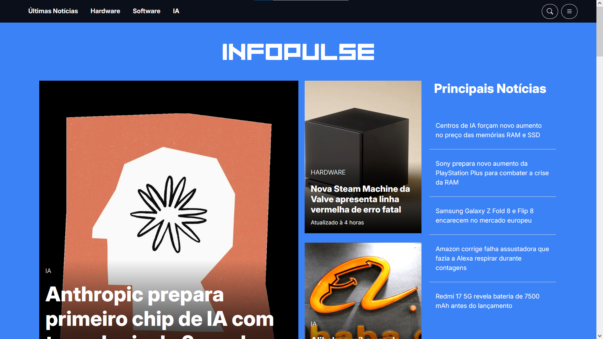
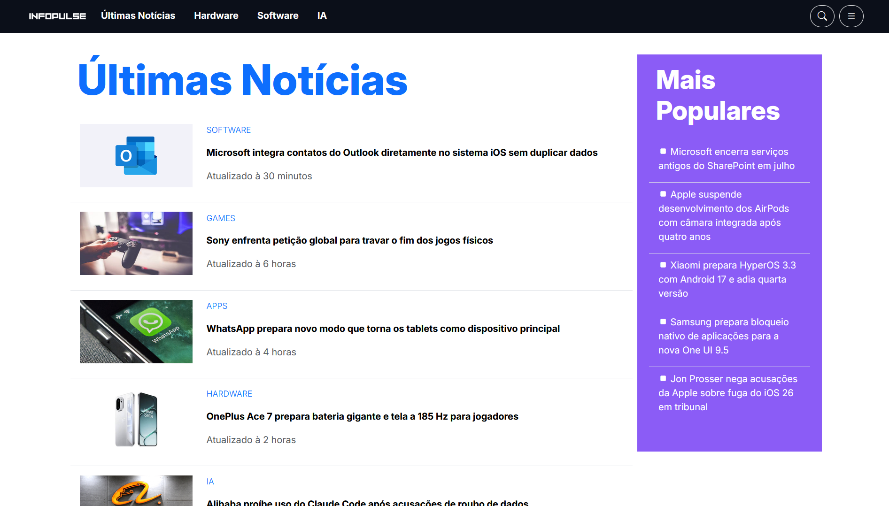

    
  <strong> Portal de Notícias de Tecnologia - Projeto de Portfólio</strong>

## 📰 Introdução 

InfoPulse é um site de notícias de tecnologia inspirado no TechCrunch. Nesse projeto, desenvolvi apenas o front-end da página inicial, me preocupando com design e experiência do usuário, por isso, no momento, o site não tem nenhum tipo de interação.

Nesse site, me preocupei em fazer uma boa experiência para o usuario, design com cores agradáveis e elementoss bem posicionados. Além disso, implementei responsividade com classes bootstrap e media querys para proporcionar uma boa visualização em qualquer dispositivo.

## 🖥️ Tecnologias

- 
- 
- 
- 

## 📷 Imagens

    
    

